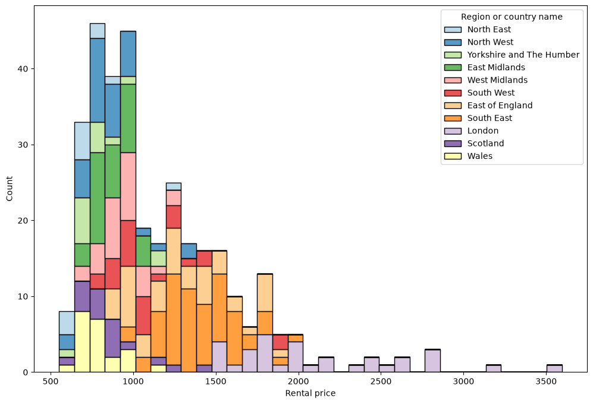
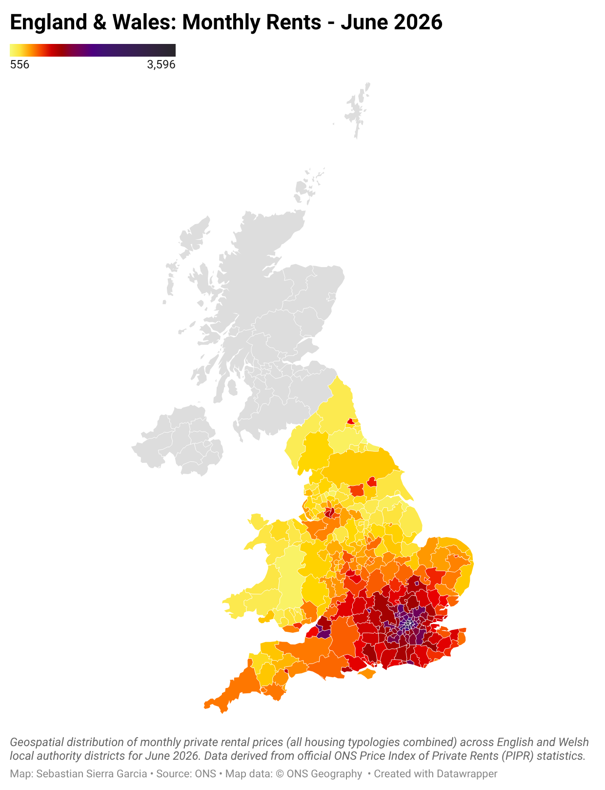

# uk-rental-prices
Data Analysis of UK private rental price statistics for June 2026 using Python and ONS data

## KEY FINDINGS
1) The most expensive monthly rents (not discriminating by housing typology) for June 2026 were found in the local authority districts of Kensington and Chelsea (£3,596), and Westminster (£3,168), both being central London borough, while the cheapest rent was found in Hartlepool (£556).
2) The data, as expected, has a strong right-skew, with the long right tail consisting entirely of London boroughs. This can be seen in the histogram below (which can be generated by running the notebooks sequentially)

3) I also created a map with the data. The png can be seen here below, and this is the datawrapper link to access the interactive version: https://www.datawrapper.de/_/MCMF1/

Scotland and Norther Ireland could not be mapped though. NI has no data, and Scotland uses Broad Rental Market Areas for this information, which is a geometry not currently supported by Datawrapper coropleths. 

## HOW TO RUN IT
1. Clone the Repository
2. Navigate to the project folder
3. Create the environment from the yml file: ***"conda env create -f environment.yml"***
4. Activate the environment: 
***"conda activate uk_rental_prices"***
5. Download the ONS file following the instructions under the Data Sources sections. Save the file in `data/raw`
6. Navigate to `notebooks/` folder and run the notebooks sequentially

## PROJECT STRUCTURE
*  `data/`: Raw and processed datasets.
* `notebooks/`: Jupyter notebooks.
* `src/`: Python scripts.
* `environment.yml`: Conda environment dependencies.
* `README.md`: Project documentation.

## DATA SOURCES
The data for this analysis was obtained from the UK National Statistical Office: the ONS (Office of National Statistics)

Private rental prices data can be specifically found here (download the July 22-2026 edition of the dataset):
* [https://www.ons.gov.uk/economy/inflationandpriceindices/datasets/priceindexofprivaterentsukmonthlypricestatistics]

